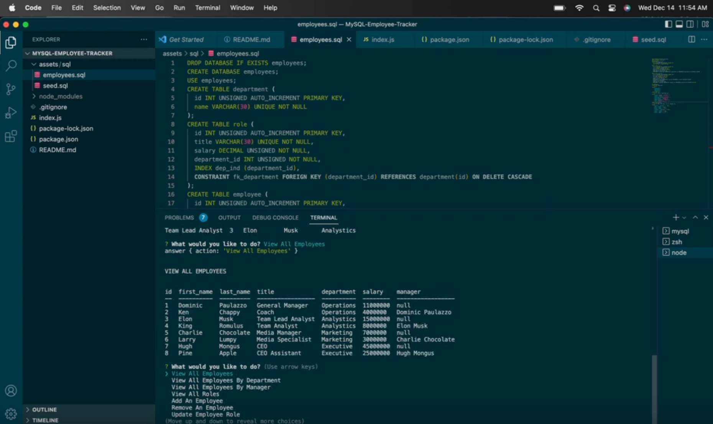

# MySQL Employee Tracker

With so much data in todays world, I would only make sense for those who deal with large amounts of data on a daily basis to have a useful application that helps them sort through said data. Using this application allows users to get quick and easy access to all of their database properties and execute the required tasks needed. This specific application is designed so developers can see data relating to each employee of their company. Using JavaScript, Node.JS, Express.JS, and MySQL we can quickly and easily operate through large amounts of data in an organized fashion.

## User Story

AS A business owner

I WANT to be able to view and manage the departments, roles, and employees in my company

SO THAT I can organize and plan my business

## Acceptance Criteria

GIVEN a command-line application that accepts user input

WHEN I start the application

THEN I am presented with the following options: view all departments, view all roles, view all employees, add a department, add a role, add an employee, and update an employee role

WHEN I choose to view all departments

THEN I am presented with a formatted table showing department names and department ids

WHEN I choose to view all roles

THEN I am presented with the job title, role id, the department that role belongs to, and the salary for that role

WHEN I choose to view all employees

THEN I am presented with a formatted table showing employee data, including employee ids, first names, last names, job titles, 
departments, salaries, and managers that the employees report to

WHEN I choose to add a department

THEN I am prompted to enter the name of the department and that department is added to the database

WHEN I choose to add a role

THEN I am prompted to enter the name, salary, and department for the role and that role is added to the database

WHEN I choose to add an employee

THEN I am prompted to enter the employee’s first name, last name, role, and manager, and that employee is added to the database

WHEN I choose to update an employee role

THEN I am prompted to select an employee to update and their new role and this information is updated in the database

## About

Application tree structure: The application is user friendly and built to handle large amount of data (ie: what if the company have about 10,000 employees and 1,000+ roles)

* View All Employees - command that prints all employees in a table. Table contains employee id, employee name, title, department, salary and employee manager.

* View All Employees By Manager - command that prints all employee managers and their associates.

* View All Employees By Department - command that prints all departments and the employee under it.

* View All Roles - command that prints all roles/ title and the corresponding employee.

* Add An Employee - command line that adds a new entry to the database.

* Remove An Employee - command line that deletes an employee from the database

* Update Employee Role - command line that updates the role/ title of an employee.

## Install
* npm i - to install all file in order for npm to work
* npm i inquirer - to use inquirer (to interact with the user via command line)
* npm init - to create a json file
* npm i mysql - to connect to MySql database
* npm console.table - to format tables

## Run 
* node index.js

## Built with
* JavaScript
* Node.js
* MySQL
* jQuery

## Demo

Check out the video demo here!----> <a href="https://youtu.be/NCJeILWey24"> Employee Tracker App in Action!</a>.

## Developed By:
* Dominic Paulazzo

